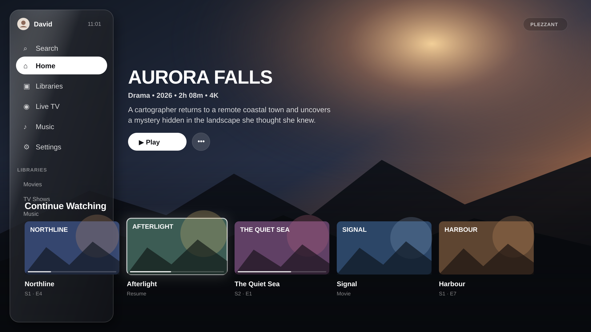

<h1>
  
  Plezzant
</h1>

A cinematic, calm, TV-first client for **Plex Media Server**, designed for
**Android TV and Google TV** and driven entirely by the remote's D-pad.

* Artwork-led home with a full-bleed spotlight hero and Continue Watching / Next Up rows
* Contextual ambience: colour pulled from the focused artwork, snapped perceptually
  (CIELAB, CIEDE2000) onto a fixed 26-hue palette
* Restrained glass on floating surfaces (navigation, menus, player chrome), with an
  automatic solid fallback on weaker TVs
* Inter typography and Lucide iconography throughout
* Deep Plex support: PIN sign-in, Plex Home and protected profiles, multiple servers,
  local/remote/relay connections, collections, playlists, extras, versions and editions,
  chapters, intro and credits markers, Live TV and DVR
* Playback that prefers **Direct Play**, falls back to Direct Stream or Transcode only
  when needed, and shows which one it chose in the player's performance overlay

## Preview



The preview is a design-reference render of the current TV composition: full-bleed
artwork, floating glass navigation, the shared TV safe frame, large-screen type,
cinematic 16:9 shelves, and focus depth.

## Documentation

| Document | What's in it |
|---|---|
| [docs/plezzant/TESTING.md](docs/plezzant/TESTING.md) | Step-by-step install and test guide (emulator, real TV, sideload) |
| [docs/plezzant/ARCHITECTURE.md](docs/plezzant/ARCHITECTURE.md) | How the app is put together, and what must survive any redesign |
| [docs/plezzant/FEATURE_PARITY.md](docs/plezzant/FEATURE_PARITY.md) | Capability tracker: inherited, restyled, added, missing |

## Getting a build

Every push to the `plezzant` branch builds APKs in GitHub Actions
(**Actions → Plezzant Android TV APK → latest run → Artifacts → plezzant-apks**).
See [TESTING.md](docs/plezzant/TESTING.md) for installation.

## Building from source

Prerequisites: Flutter SDK 3.47+, Android Studio (Android SDK, NDK and CMake are
fetched by Gradle on first build), JDK 17+.

```bash
git clone https://github.com/myplexscripts/plezy.git plezzant
cd plezzant
git checkout plezzant
flutter pub get
flutter run            # with an Android TV emulator or device connected
flutter build apk --release --split-per-abi
```

Run the checks:

```bash
flutter analyze lib test
flutter test
dart run scripts/checks/check_icon_consistency.dart
```

## License

Plezzant is free software under the [GNU GPL v3](LICENSE). It is a modified
version of an existing GPL-3.0 media-server client ([upstream](https://github.com/edde746/plezy));
the git history records all changes. Bundled fonts: Inter (SIL OFL 1.1, see
`assets/fonts/OFL-Inter.txt`). Icons: Lucide (ISC).
